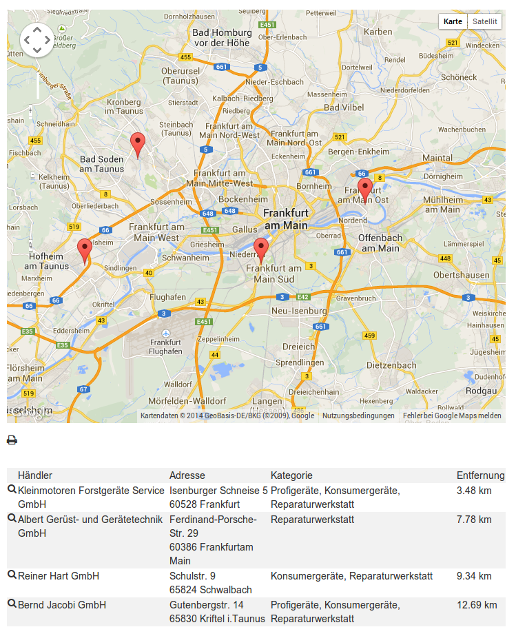

.. include:: /Includes.rst.txt

.. _introduction:

============
Introduction
============

Search with result map and list
===============================

Purpose of this extension is, to have a search for locations based on
an entered or configured address. The result displays a google map with
marker for each location and a list of all locations. On click on a
marker an info window with additional informations get shown.

Search form:
============

.. figure:: Images/introduction_search.png
   :alt: Search form
   :width: 711px

Result map and list:
====================

Single points of interest
=========================

Its also possible to pre define a single location to display it on the
map without search form. This is useful to have map with single point
of interesst.
For developer its also possible to use the plugin in their extension
as map renderer for the location.

How geolocations are computed
=============================

Every location gets geocoded with help of google maps api after saving
the record in backend. By this its important to know, that the google
maps website needs to be reached from the webserver.

The coordinates are stored in the record each time when the record
gets saved. If at one point the address gets changed the coordinate
gets fetched from the api again.

Search queries get geocoded the same way by the google maps api. To
reduce the api requests the coordinates get stored in the session.
So if a query gets send another time the api do not get requested again.
